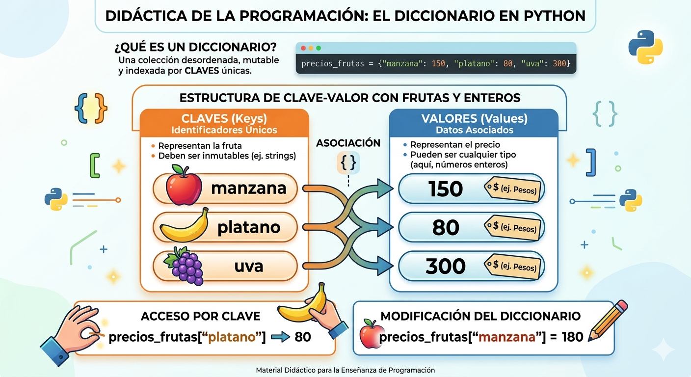

# dictionary-python
Concepts and Exercises of Dictionaries in Python

- Dictionaries are structured data; that is, they refer to a collection of data.

- They are an unordered collection of **key:value** pairs, known as elements or items.

- They are mutable once defined, new elements can be added, and existing elements can be modified or deleted.

- They are also known as associative arrays.

## Graphical Representation of an Dictionary



## Syntaxis

`dictionary_name= {key1:value1, key2:value2, ...}`

- Every Item or Object has the shape of **key:value**
- In every Intem there's a key and one or more values. If the value its unknown, it can be completed with *None*
- The Dictionaries Items are Indexed by the key
- The keys can only be inmutable data
- The values can be mutable data or inmutable data
- The keys cant repeat inside a Dictionary

### Example

`fruits= {'apple':150, 'banana':80}`

## Operations

### Add Items

`dictionary_name[key]= value`

`fruits['grape']= 300`

### Consult or Modify elements

`print('The value of Banana is: ', fruits['Banana'])`

### Delete Items

`del fruits['apple']`

### Ownership Operator

``` Py
if 'grape' in fruits:
    print(The grape its in the Dictionary)
else:
    print(The grape isnt in the Dictionary)
```

### Excersise
Create a program in Python that uses an Dictionary to save YOUR friend's names (in MAYUS).. and your phone number-. In this case, the Dictionary acts like an Phone Book . The program will ask Names and Phone Numbers and it will be saving them in the Dictionary. AND!! The program must allow to look up or delete a phone number. (Incluide a Menu of Options)